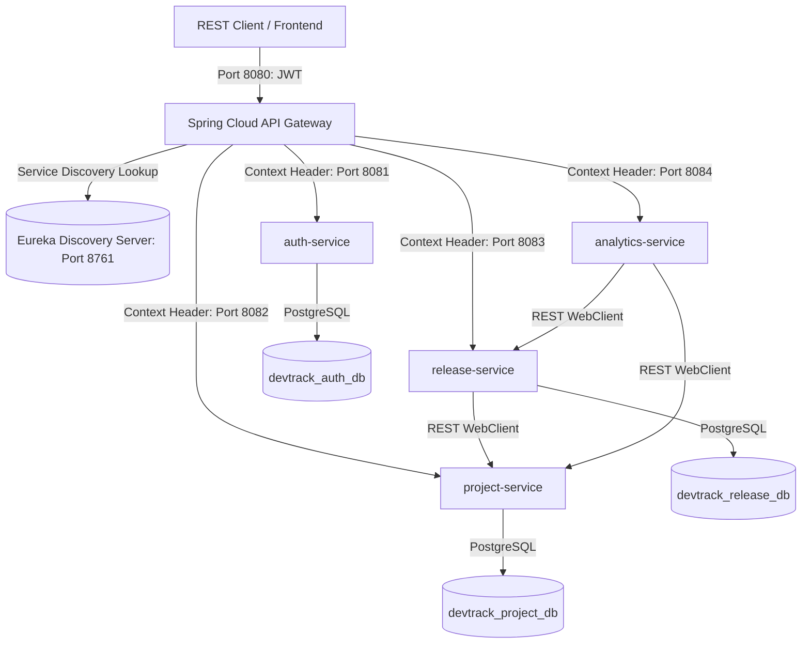
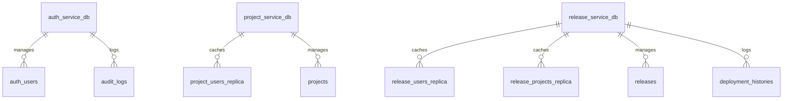

# DevTrack - Distributed Microservices Release Management and Developer Analytics Platform

DevTrack is an enterprise-grade, highly scalable software release management and developer analytics platform. Originally designed as a monolith, it has been successfully refactored into a fully decoupled, distributed Spring Cloud microservices architecture built on Spring Boot 3.3.0, Java 21 LTS, Netflix Eureka Service Discovery, Spring Cloud API Gateway, and PostgreSQL.

The platform enables organizations to create and manage software projects, dynamically assign developer teams, track releases through stage transitions, log deployment histories across environments, maintain secure centralized identities, and perform aggregated developer activity analytics without direct database joins.

---

## Architectural Topology

The distributed architecture coordinates several functional layers: an Ingress/Routing layer, a Service Discovery layer, and multiple isolated, decoupled Domain microservices communicating via load-balanced WebClient calls.



---

## Core System Modules

### 1. Ingress and Routing (api-gateway)
* Port: 8080
* Description: Acts as the unified entryway for all external clients. Intercepts incoming HTTP requests, validates JWT signatures centrally using standard cryptographic keys, extracts principal claims (username, user role, user ID), and forwards them downstream via HTTP request headers (X-User-Name, X-User-Role). This isolates token parsing entirely to the gateway.

### 2. Service Registry (discovery-server)
* Port: 8761
* Description: Orchestrated via Spring Cloud Netflix Eureka. Dynamically tracks all active downstream instances of the domain microservices, facilitating load-balanced, location-transparent, inter-service communications using Eureka service IDs (e.g., project-service, release-service).

### 3. Identity and Auditing (auth-service)
* Port: 8081
* Database: devtrack_auth_db
* Description: Manages user registration, password encryption, identity lookups, and JWT credential issuing. It also retains an aspect-oriented security logging framework to log successful and failed access patterns inside an audit log database.

### 4. Workspace Management (project-service)
* Port: 8082
* Database: devtrack_project_db
* Description: Administers projects and developer team memberships. Features a decoupled user profile caching replica. When assigning users or listing projects, it queries auth-service dynamically using WebClient to populate and cache profile rows in the local database.

### 5. Release Pipelines (release-service)
* Port: 8083
* Database: devtrack_release_db
* Description: Tracks project release versions through lifecycle stages: Code Review, Testing, Approval, Deployed, and Failed. It also records environment deployment histories. It uses local caching replicas of Project and User tables, dynamically fetched and validated on-demand from project-service and auth-service.

### 6. Aggregation and Metrics (analytics-service)
* Port: 8084
* Database: None (Database-free)
* Description: Consolidates metrics from multiple domains. Synthesizes deployment success rates, release frequencies, and developer productivity levels on-demand by executing parallel, non-blocking WebClient lookups to project-service and release-service.

---

## Port Registry

* Ingress Gateway: 8080
* Eureka Discovery Server: 8761
* auth-service: 8081
* project-service: 8082
* release-service: 8083
* analytics-service: 8084

---

## Database Per Service Isolation

To guarantee loose coupling, every domain service binds to its own isolated database instance. Cross-database queries and foreign keys across services are strictly prohibited.



---

## API Specification

All endpoints are exposed through the API Gateway on port 8080. Downstream services enforce authorization context through custom Spring Security filter chains matching the monolith APIs.

### Authentication (/api/v1/auth)
* POST /register: Create a user account (Payload: username, email, password, role).
* POST /login: Authenticate credentials and return a Bearer JWT token (Payload: username, password).
* GET /users/{id}: Fetch user details by ID (Inter-service endpoint).
* GET /users/username/{username}: Fetch user details by username (Inter-service endpoint).
* GET /users/role/{role}: List users by role (Inter-service endpoint).

### Projects (/api/v1/projects)
* POST /: Create a project. Requires Admin or Release Manager role.
* GET /: Get paginated projects associated with the caller.
* GET /{id}: Retrieve project details by ID.
* POST /{id}/members/{userId}: Assign a developer to the project. Requires Admin or Release Manager.
* DELETE /{id}/members/{userId}: Remove a member from the project. Requires Admin or Release Manager.
* DELETE /{id}: Delete a project. Requires Admin or Release Manager.

### Releases (/api/v1/releases)
* POST /: Create a release version. Initial stage defaults to Code Review. Requires Admin or Release Manager.
* GET /?projectId=...: Get paginated releases for a specific project.
* GET /{id}: Retrieve release details by ID.
* PUT /{id}/stage: Transition the release stage. Transitions to Deployed/Failed automatically log deployment outcomes. Requires Admin or Release Manager.
* POST /{id}/deploy: Trigger a deployment run, logging outcome details (Payload: environment, outcome, notes). Requires Admin or Release Manager.
* GET /{id}/history: Retrieve deployment history for a release.

### Analytics (/api/v1/analytics)
* GET /projects/{projectId}/success-rate: Computes the project's deployment success rates.
* GET /projects/{projectId}/release-frequency: Returns release stage breakdowns.
* GET /developers/activity: Returns active developer trends ranked by contributions. Requires Admin or Release Manager.

---

## Context Propagation and Security Filter Flow

The platform implements transparent downstream method-level security:

1. The API Gateway interceptor verifies the Bearer JWT token.
2. The Gateway maps token claims into HTTP request headers: `X-User-Name` and `X-User-Role`.
3. Downstream services configure a standard `OncePerRequestFilter` (named GatewayHeaderFilter) that extracts the username and role headers from the incoming request.
4. The filter instantiates a standard Spring Security `UsernamePasswordAuthenticationToken` and injects it directly into the thread-local `SecurityContextHolder`.
5. This allows downstream domain controllers to execute standard method-level `@PreAuthorize` rules (e.g. `hasAnyRole('ROLE_ADMIN')`) with complete transparency, preserving existing code patterns.

---

## Technical Optimizations

* Decoupled User Replica View Pattern: Downstream databases maintain lightweight local representations of User profiles. This avoids distributed joins, keeping lookup reads local and extremely fast.
* On-Demand Replica Synchronization: If a required replica record does not exist locally, the service automatically performs a load-balanced HTTP request to auth-service or project-service to cache it on-the-fly.
* Parallel WebClient Fetching: The analytics-service fires asynchronous, parallel non-blocking REST calls to downstream services to synthesize aggregates rapidly.
* Resilient Fallbacks: Inter-service REST WebClient calls handle connectivity errors gracefully, reverting to local cached replicas if downstream dependencies are temporarily unreachable.

---

## Installation and Execution

### Prerequisites
* Java 21 LTS
* Apache Maven 3.8+
* Docker Desktop (for containerized PostgreSQL instances)

### Step 1: Spin Up the Database Containers
Launch isolated databases using Docker Compose:
```bash
docker-compose up -d
```
This runs three isolated instances:
* devtrack_auth_db on port 5432
* devtrack_project_db on port 5432 (mapped internally, running separately)
* devtrack_release_db on port 5432 (mapped internally, running separately)
Database initialization tables and cache templates are configured in `init-db/init.sql`.

### Step 2: Build the Multi-Module Architecture
Compile all services from the root folder:
```bash
mvn clean package -DskipTests
```
This builds active executable jar packages for each service inside their respective target directories.

### Step 3: Run the Cloud System in Order
For proper registration, launch the services sequentially, waiting a few seconds between each start:

1. **Launch Discovery Server**:
   ```bash
   cd discovery-server
   mvn spring-boot:run
   ```
   Open `http://localhost:8761` in your browser to inspect the Netflix Eureka registration dashboard.

2. **Launch API Gateway**:
   ```bash
   cd ../api-gateway
   mvn spring-boot:run
   ```

3. **Launch Domain Services**:
   Open separate shell terminals for each:
   ```bash
   cd ../auth-service
   mvn spring-boot:run
   ```
   ```bash
   cd ../project-service
   mvn spring-boot:run
   ```
   ```bash
   cd ../release-service
   mvn spring-boot:run
   ```
   ```bash
   cd ../analytics-service
   mvn spring-boot:run
   ```

4. **Verify Discovery Registration**:
   Refresh your Eureka registry page at `http://localhost:8761`. You should see `AUTH-SERVICE`, `PROJECT-SERVICE`, `RELEASE-SERVICE`, `ANALYTICS-SERVICE`, and `API-GATEWAY` successfully registered.

All REST operations are now fully routed through `http://localhost:8080`.
