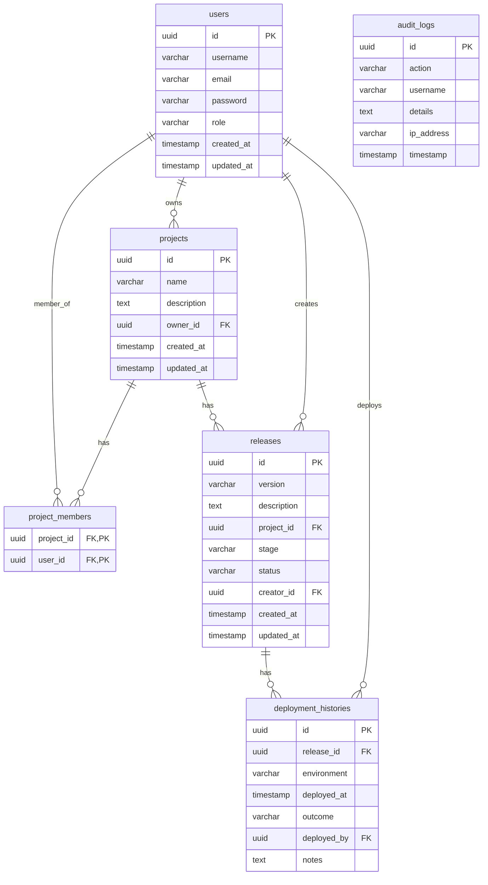

# DevTrack - Release Management and Developer Analytics Platform

DevTrack is an enterprise-grade backend application built on Spring Boot 3.3.0, Java 21 LTS, and PostgreSQL. It simulates a secure, robust DevSecOps and release management workflow. The platform allows organizations to manage software projects, assign developer teams, track releases through rigorous lifecycle stages, record deployment logs across environments, monitor systems through an automated security audit logging network, and compute developer performance metrics.

---

## Core Capabilities

* Secure Authentication and RBAC: Utilizes Spring Security and stateless JWT authentication to enforce Role-Based Access Control. Platform endpoints are partitioned among Admin, Release Manager, and Developer roles.
* Project Management: Creation and administration of software projects, with assignment mechanisms to tie developers to specific project scopes.
* Release Lifecycle Tracking: Moves software releases through stages: Code Review, Testing, Approval, and Deployment. Transitions automatically create deployment logs when entering final states.
* Aspect-Oriented Security Auditing (AOP): Uses a custom annotation and aspect to intercept controller requests, capturing IP addresses, caller names, timestamps, and parameters. The aspect automatically redacts passwords and sensitive data before logging.
* Developer Analytics: Computes deployment success rates (successful versus failed runs), release frequency timelines, and developer activity scores directly in the database using optimized aggregate counts.

---

## Database Architecture

The database is fully normalized and uses UUID primary keys to support microservice scaling and prevent key collision.



---

## API Documentation

### Authentication (`/api/v1/auth`)
* POST /register: Create a user account (Payload: username, email, password, role).
* POST /login: Authenticate credentials and return a Bearer JWT token (Payload: username, password).

### Projects (`/api/v1/projects`)
* POST /: Create a project. Requires Admin or Release Manager role.
* GET /: Get paginated projects associated with the caller.
* GET /{id}: Retrieve project details by ID.
* POST /{id}/members/{userId}: Assign a developer to the project. Requires Admin or Release Manager.
* DELETE /{id}/members/{userId}: Remove a member from the project. Requires Admin or Release Manager.
* DELETE /{id}: Delete a project. Requires Admin or Release Manager.

### Releases (`/api/v1/releases`)
* POST /: Create a release for a project. Initial stage defaults to Code Review. Requires Admin or Release Manager.
* GET /?projectId=...: Get paginated releases for a specific project.
* GET /{id}: Retrieve release details by ID.
* PUT /{id}/stage: Transition the release stage (Code Review, Testing, Approval, Deployed, Failed). Final stage entry automatically logs deployment histories. Requires Admin or Release Manager.
* POST /{id}/deploy: Trigger a deployment run, transitioning release states and logging environment details (Payload: environment, outcome, notes). Requires Admin or Release Manager.
* GET /{id}/history: Retrieve the deployment logs for a release.

### Analytics (`/api/v1/analytics`)
* GET /projects/{projectId}/success-rate: Computes the project's deployment success rates.
* GET /projects/{projectId}/release-frequency: Returns release stage breakdowns.
* GET /developers/activity: Returns active developer trends ranked by contributions. Requires Admin or Release Manager.

### Security Audits (`/api/v1/audit-logs`)
* GET /: Retrieve paginated security logs, filterable by user and action. Requires Admin role.

---

## Technical Optimizations

* Batch Fetching: Added BatchSize annotations to lazy collections in Project entities to retrieve member sets in batches, eliminating collection N+1 fetch loops.
* Eager JOIN FETCH: Integrated JOIN FETCH operators into release queries within ReleaseRepository to load project and creator data in a single database round-trip.
* Database-Level Counts: Replaced in-memory stream filtering in AnalyticsService with direct count index traversals in ProjectRepository to keep memory footprint lightweight.
* Data Sanitization: The AOP audit logger contains custom regular expression filters to redact passwords and keys before logs are written to the database.

---

## Installation and Execution

### Prerequisites
* Java 21 LTS
* Apache Maven 3.8+
* Docker Desktop (for containerized database runs)

### Step 1: Initialize Database
Start the containerized PostgreSQL 16 database:
```bash
docker-compose up -d
```

### Step 2: Build and Test Compilation
Compile the files and run the test suites (H2 in-memory profile is loaded for tests):
```bash
mvn clean package
```

### Step 3: Run the Application
Start the Spring Boot server:
```bash
mvn spring-boot:run
```
The server will boot up and bind to port 8080.
